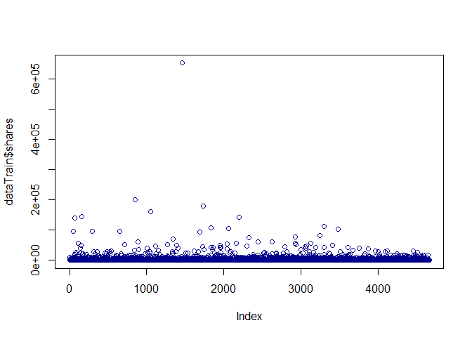
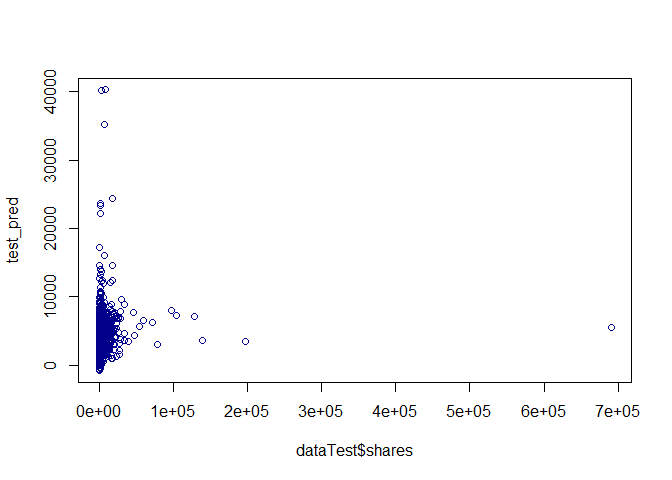

ST 558 Project 2
================
Jessica Speer
July 3, 2020

Load in and Prep Data
---------------------

``` r
#Read in data, filter according to day of week, keep relevant variables
data<-read.csv("C:\\Users\\jessi\\Documents\\ST 558\\data\\OnlineNewsPopularity.csv", header=T)
#Generate categorical outcome variable
data$sharescat[data$shares < 1400] <- 0
data$sharescat[data$shares >= 1400] <- 1
data$sharescat <- as.factor(data$sharescat)
#Create single day variable
data$day[data$weekday_is_monday==1] <- "monday"
data$day[data$weekday_is_tuesday==1] <- "tuesday"
data$day[data$weekday_is_wednesday==1] <- "wednesday"
data$day[data$weekday_is_thursday==1] <- "thursday"
data$day[data$weekday_is_friday==1] <- "friday"
data$day[data$weekday_is_saturday==1] <- "saturday"
data$day[data$weekday_is_sunday==1] <- "sunday"
#Filter according to day of week
data<-data %>% filter(day=="monday")
#Split data into training and test sets
set.seed(1)
train <- sample(1:nrow(data), size = nrow(data)*0.7)
test <- dplyr::setdiff(1:nrow(data), train)
dataTrain <- data[train, ]
dataTest <- data[test, ]
```

``` r
#par(mfrow=c(2,2))
#hist(dataTrain$shares, col="dark blue")
#hist(dataTrain$average_token_length, col="dark blue")
#hist(dataTrain$kw_avg_avg, col="dark blue")
#hist(dataTrain$LDA_03, col="dark blue")

plot(dataTrain$shares, col="dark blue")
```



``` r
#plot(dataTrain$average_token_length, col="dark blue")
#plot(dataTrain$kw_avg_avg, col="dark blue")
```

``` r
lm_fit<-train(shares ~ average_token_length + kw_avg_avg + LDA_03 + avg_negative_polarity + self_reference_avg_sharess + data_channel_is_entertainment + data_channel_is_world, data=dataTrain, method="lm")

summary(lm_fit)
```

    ## 
    ## Call:
    ## lm(formula = .outcome ~ ., data = dat)
    ## 
    ## Residuals:
    ##    Min     1Q Median     3Q    Max 
    ## -66429  -2504  -1318   -130 619187 
    ## 
    ## Coefficients:
    ##                                 Estimate Std. Error t value Pr(>|t|)    
    ## (Intercept)                    3.595e+03  1.218e+03   2.953 0.003164 ** 
    ## average_token_length          -8.923e+02  2.460e+02  -3.627 0.000289 ***
    ## kw_avg_avg                     4.887e-01  1.635e-01   2.990 0.002809 ** 
    ## LDA_03                         1.947e+03  7.561e+02   2.574 0.010073 *  
    ## avg_negative_polarity         -7.909e+03  1.649e+03  -4.796 1.67e-06 ***
    ## self_reference_avg_sharess     8.485e-02  8.763e-03   9.682  < 2e-16 ***
    ## data_channel_is_entertainment -1.464e+03  5.026e+02  -2.912 0.003612 ** 
    ## data_channel_is_world         -5.315e+02  5.037e+02  -1.055 0.291476    
    ## ---
    ## Signif. codes:  0 '***' 0.001 '**' 0.01 '*' 0.05 '.' 0.1 ' ' 1
    ## 
    ## Residual standard error: 12990 on 4654 degrees of freedom
    ## Multiple R-squared:  0.04203,    Adjusted R-squared:  0.04059 
    ## F-statistic: 29.17 on 7 and 4654 DF,  p-value: < 2.2e-16

``` r
#make predictions on test data
test_pred <- predict(lm_fit, newdata = dataTest)
residuals<-dataTest$shares - test_pred
summary(abs(residuals))
```

    ##     Min.  1st Qu.   Median     Mean  3rd Qu.     Max. 
    ##      6.0    994.6   1837.3   3628.4   3292.4 684836.5

``` r
plot(dataTest$shares,test_pred, col="dark blue")
```



Fit random forest
=================

``` r
set.seed(16)
trctrl <- trainControl(method = "repeatedcv", number = 10, repeats = 3)
#rf_fit <- train(sharescat ~ average_token_length + kw_avg_avg + LDA_03 + avg_negative_polarity + self_reference_avg_sharess + data_channel_is_entertainment + data_channel_is_world, data = dataTrain, method = "rf", trControl=trctrl, preProcess = c("center", "scale"))
#rf_fit
#make predictions on test data
#test_pred <- predict(rf_fit, newdata = dataTest)
#res <- confusionMatrix(test_pred, dataTest$sharescat)
#res
#misclassification rate
#1-sum(diag(res$table))/sum(res$table)
```
