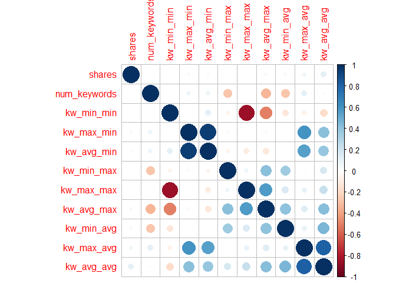
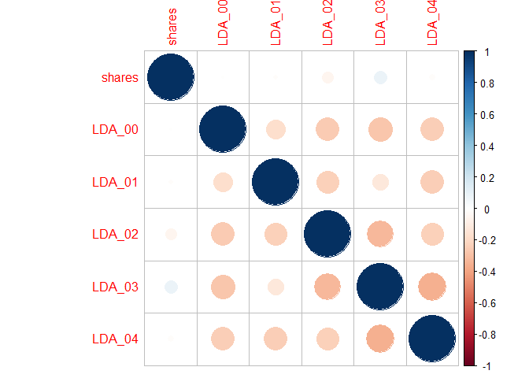
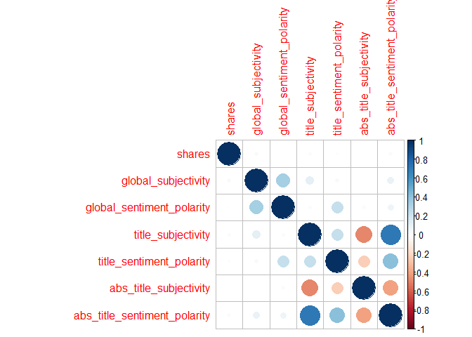
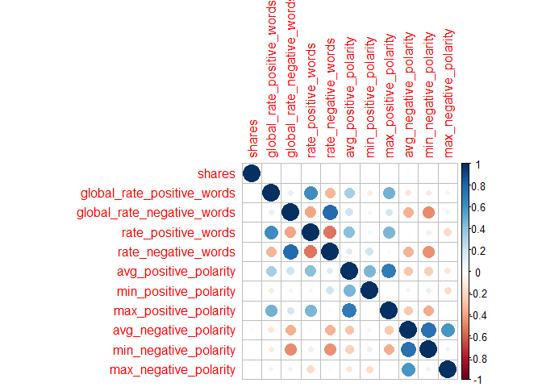

ST 558 Project 2
================
Jessica Speer
July 3, 2020

General Report
==============

Data exploration was done on the full data set in order to decide which variables to focus on. This page details the data exploration on the full data. The "Daily Reports" give results for each respective day.

Load and Prep Data
------------------

``` r
#Read in data, filter according to day of week, keep relevant variables
data<-read.csv("C:\\Users\\jessi\\Documents\\ST 558\\data\\OnlineNewsPopularity.csv", header=T)
#Generate categorical outcome variable
data$sharescat[data$shares < 1400] <- 0
data$sharescat[data$shares >= 1400] <- 1
data$sharescat <- as.factor(data$sharescat)
```

Explore correlations between variables
--------------------------------------

There are a large number of variables, so they are split into groups to be analyzed. Continuous variables are explored below.

### "Words" group

``` r
ncorr <- cor(select(data, shares, n_tokens_title, n_tokens_content, n_unique_tokens, n_non_stop_words,
                    n_non_stop_unique_tokens, num_hrefs, num_self_hrefs, num_imgs, num_videos, 
                    average_token_length))
corrplot(ncorr, method="circle")
```


None of the variables appear to be particularly correlated with `shares`. Thus, `average_token_length` will be chosen from this group since it is an average representation.

### "Keywords" group

``` r
kwcorr <- cor(select(data, shares, num_keywords, kw_min_min, kw_max_min, kw_avg_min, kw_min_max, kw_max_max, 
                     kw_avg_max, kw_min_avg, kw_max_avg, kw_avg_avg))
corrplot(kwcorr, method="circle")
```



`kw_avg_avg` will be chosen from this group as it has the highest correlation with `shares`.

### "LDA" group

``` r
ldacorr <- cor(select(data, shares, c(LDA_00:LDA_04)))
corrplot(ldacorr, method="circle")
```



`LDA_03` will be chosen from this group as it has the highest correlation with `shares`.

### "Sentiment" group

``` r
subcorr <- cor(select(data, shares, global_subjectivity, global_sentiment_polarity, title_subjectivity,
                      title_sentiment_polarity, abs_title_subjectivity, abs_title_sentiment_polarity))
corrplot(subcorr, method="circle")
```



Again, none of the variables appear to be particularly correlated with `shares`. Thus, `global_subjectivity` is chosen as it has a slight correlation.

### "Polarity" group

``` r
poscorr <- cor(select(data, shares, global_rate_positive_words, global_rate_negative_words, rate_positive_words,
                      rate_negative_words, avg_positive_polarity, min_positive_polarity, max_positive_polarity,
                      avg_negative_polarity, min_negative_polarity, max_negative_polarity))
corrplot(poscorr, method="circle")
```



`avg_negative_polarity` will be chosen from this group as it has a slight correlation and represents an average for the overall group.

### "Self-Reference" group

``` r
refcorr <- cor(select(data, shares, self_reference_min_shares, self_reference_max_shares, 
                      self_reference_avg_sharess))
corrplot(refcorr, method="circle")
```


`self_reference_avg_sharess` will be chosen from this group as it has a modest correlation with `shares` and represents an average for the overall group.

### Final selected continuous models

``` r
finalcorr <- cor(select(data, shares, average_token_length, kw_avg_avg, LDA_03, avg_negative_polarity,
                        self_reference_avg_sharess))
corrplot(finalcorr, method="circle")
```


There is some collinearity, especially between `average_token_length` and `avg_negative_polarity`.

Model selection
---------------

We will now use the stepwise function to select our final variables. We will include the continuous variables from above, as well as the binary variables for type of data channel.

``` r
step(lm(shares ~ average_token_length + kw_avg_avg + LDA_03 + avg_negative_polarity + global_subjectivity +
        self_reference_avg_sharess + data_channel_is_lifestyle + data_channel_is_entertainment + 
        data_channel_is_bus + data_channel_is_socmed + data_channel_is_tech + data_channel_is_world, data=data))
```

    ## Start:  AIC=741526.2
    ## shares ~ average_token_length + kw_avg_avg + LDA_03 + avg_negative_polarity + 
    ##     global_subjectivity + self_reference_avg_sharess + data_channel_is_lifestyle + 
    ##     data_channel_is_entertainment + data_channel_is_bus + data_channel_is_socmed + 
    ##     data_channel_is_tech + data_channel_is_world
    ## 
    ##                                 Df  Sum of Sq        RSS    AIC
    ## <none>                                        5.2627e+12 741526
    ## - data_channel_is_socmed         1 9.7739e+08 5.2637e+12 741532
    ## - data_channel_is_lifestyle      1 9.9923e+08 5.2637e+12 741532
    ## - LDA_03                         1 1.2033e+09 5.2639e+12 741533
    ## - global_subjectivity            1 1.5662e+09 5.2643e+12 741536
    ## - data_channel_is_tech           1 1.5760e+09 5.2643e+12 741536
    ## - avg_negative_polarity          1 1.5869e+09 5.2643e+12 741536
    ## - data_channel_is_bus            1 1.7245e+09 5.2644e+12 741537
    ## - average_token_length           1 1.8746e+09 5.2646e+12 741538
    ## - data_channel_is_world          1 3.5501e+09 5.2663e+12 741551
    ## - data_channel_is_entertainment  1 7.1574e+09 5.2699e+12 741578
    ## - self_reference_avg_sharess     1 8.2487e+09 5.2710e+12 741586
    ## - kw_avg_avg                     1 1.9072e+10 5.2818e+12 741668

    ## 
    ## Call:
    ## lm(formula = shares ~ average_token_length + kw_avg_avg + LDA_03 + 
    ##     avg_negative_polarity + global_subjectivity + self_reference_avg_sharess + 
    ##     data_channel_is_lifestyle + data_channel_is_entertainment + 
    ##     data_channel_is_bus + data_channel_is_socmed + data_channel_is_tech + 
    ##     data_channel_is_world, data = data)
    ## 
    ## Coefficients:
    ##                   (Intercept)           average_token_length  
    ##                     2.222e+03                     -3.472e+02  
    ##                    kw_avg_avg                         LDA_03  
    ##                     6.185e-01                      9.120e+02  
    ##         avg_negative_polarity            global_subjectivity  
    ##                    -1.794e+03                      2.392e+03  
    ##    self_reference_avg_sharess      data_channel_is_lifestyle  
    ##                     1.919e-02                     -9.134e+02  
    ## data_channel_is_entertainment            data_channel_is_bus  
    ##                    -1.680e+03                     -1.015e+03  
    ##        data_channel_is_socmed           data_channel_is_tech  
    ##                    -8.698e+02                     -9.559e+02  
    ##         data_channel_is_world  
    ##                    -1.434e+03

The final variables are: `average_token_length`, `kw_avg_avg`, `global_subjectivity`, `avg_negative_polarity`, `self_reference_avg_sharess`, `data_channel_is_entertainment`, `data_channel_is_tech`, `data_channel_is_world`.
