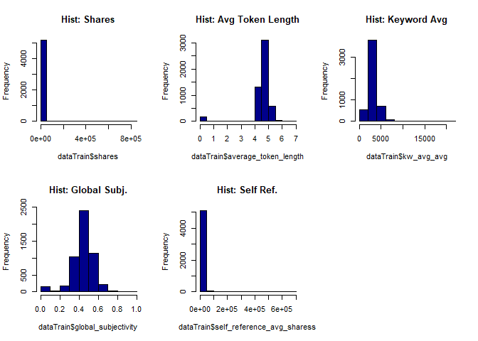
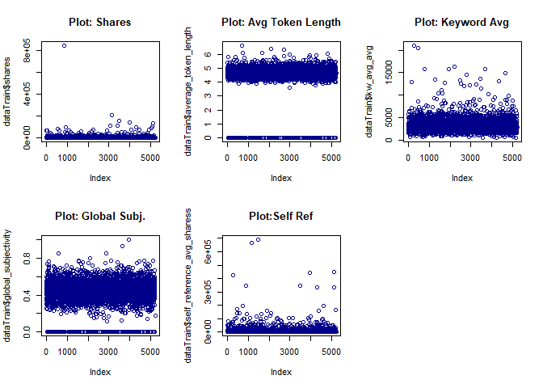
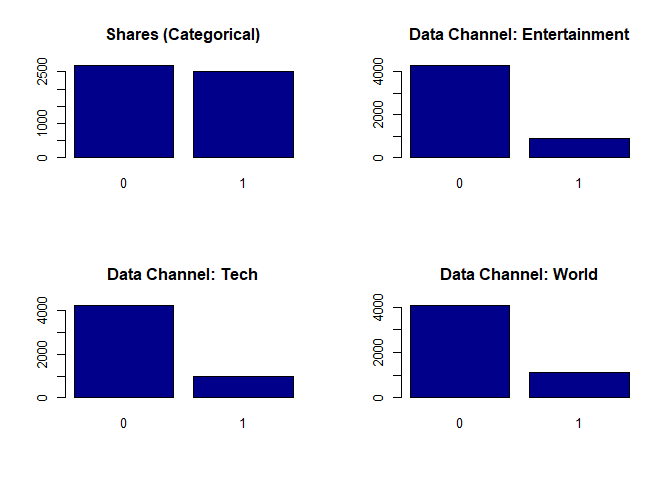
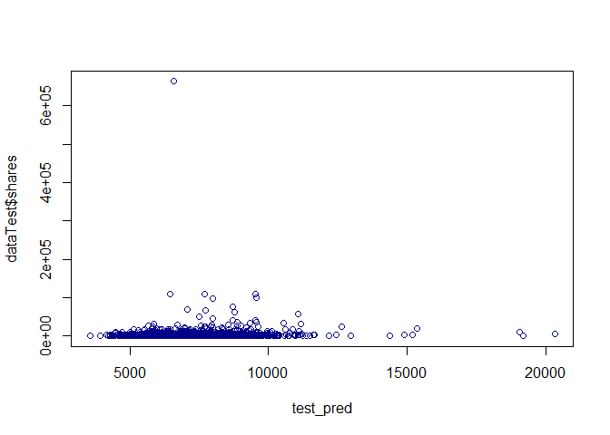
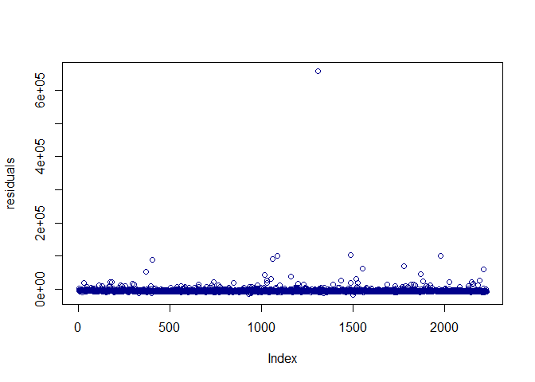

ST 558 Project 2
================
Jessica Speer
July 3, 2020

Introduction
------------

In this report, the "Online News Popularity" Data Set is used from the UCI Machine Learning Repository. The data includes variables that describe certain features regarding articles that were published by Mashable over a course of two years. The outcome variable is the number of social media "shares", which is a metric for popularity.

We will be creating two models, a linear regression model and a random forest model. We will use the continuous outcome for the linear regression model, and a binary version for the random forest (&lt; 1400 and ≥ 1400).

Data
----

The variables have been narrowed down in a general program [here](st558proj2.md). The final variables are: `average_token_length`, `kw_avg_avg`, `global_subjectivity`, `avg_negative_polarity`, `self_reference_avg_sharess`, `data_channel_is_entertainment`, `data_channel_is_tech`, `data_channel_is_world`.

Here is a brief description of each variable:

-   `average_token_length`: Average length of the words in the content
-   `kw_avg_avg`: Avg. keyword (avg. shares)
-   `global_subjectivity`: Text subjectivity
-   `avg_negative_polarity`: Avg. polarity of negative words
-   `self_reference_avg_sharess`: Avg. shares of referenced articles in Mashable
-   `data_channel_is_entertainment`: Is data channel 'Entertainment'?
-   `data_channel_is_tech`: Is data channel 'Tech'?
-   `data_channel_is_world`: Is data channel 'World'?

Summarizations
--------------

### Load and Prep the Data.

``` r
#Read in data
data<-read.csv("C:\\Users\\jessi\\Documents\\ST 558\\data\\OnlineNewsPopularity.csv", header=T)
#Generate categorical outcome variable
data$sharescat[data$shares < 1400] <- 0
data$sharescat[data$shares >= 1400] <- 1
data$sharescat <- as.factor(data$sharescat)
#Create single day variable
data$day[data$weekday_is_monday==1] <- "monday"
data$day[data$weekday_is_tuesday==1] <- "tuesday"
data$day[data$weekday_is_wednesday==1] <- "wednesday"
data$day[data$weekday_is_thursday==1] <- "thursday"
data$day[data$weekday_is_friday==1] <- "friday"
data$day[data$weekday_is_saturday==1] <- "saturday"
data$day[data$weekday_is_sunday==1] <- "sunday"
#Filter according to day of week
data<-data %>% filter(day=="monday")
#Split data into training and test sets
set.seed(1)
train <- sample(1:nrow(data), size = nrow(data)*0.7)
test <- dplyr::setdiff(1:nrow(data), train)
dataTrain <- data[train, ]
dataTest <- data[test, ]
```

### Histograms and Plots (Continuous Vars)

``` r
par(mfrow=c(2,3))
hist(dataTrain$shares, col="dark blue", main="Hist: Shares")
hist(dataTrain$average_token_length, col="dark blue", main="Hist: Avg Token Length")
hist(dataTrain$kw_avg_avg, col="dark blue", main="Hist: Keyword Avg")
hist(dataTrain$global_subjectivity, col="dark blue", main="Hist: Global Subj.")
hist(dataTrain$self_reference_avg_sharess, col="dark blue", main="Hist: Self Ref.")

par(mfrow=c(2,3))
```



``` r
plot(dataTrain$shares, col="dark blue", main="Plot: Shares")
plot(dataTrain$average_token_length, col="dark blue", main="Plot: Avg Token Length")
plot(dataTrain$kw_avg_avg, col="dark blue", main="Plot: Keyword Avg")
plot(dataTrain$global_subjectivity, col="dark blue", main="Plot: Global Subj.")
plot(dataTrain$self_reference_avg_sharess, col="dark blue", main="Plot:Self Ref")
```



### Bar Plots (Binary Vars)

``` r
dataTrain$sharescat<-as.factor(dataTrain$sharescat)
dataTrain$data_channel_is_entertainment<-as.factor(dataTrain$data_channel_is_entertainment)
dataTrain$data_channel_is_tech<-as.factor(dataTrain$data_channel_is_tech)
dataTrain$data_channel_is_world<-as.factor(dataTrain$data_channel_is_world)
sharecounts<-table(dataTrain$sharescat)
entcounts<-table(dataTrain$data_channel_is_entertainment)
techcounts<-table(dataTrain$data_channel_is_tech)
worldcounts<-table(dataTrain$data_channel_is_world)
par(mfrow=c(2,2))
barplot(sharecounts, col="dark blue", main="Shares (Categorical)")
barplot(entcounts, col="dark blue", main="Data Channel: Entertainment")
barplot(techcounts, col="dark blue", main="Data Channel: Tech")
barplot(worldcounts, col="dark blue", main="Data Channel: World")
```



Models
------

### Linear Regression

``` r
dataTrain$data_channel_is_entertainment<-as.numeric(dataTrain$data_channel_is_entertainment)
dataTrain$data_channel_is_tech<-as.numeric(dataTrain$data_channel_is_tech)
dataTrain$data_channel_is_world<-as.numeric(dataTrain$data_channel_is_world)
#Fit linear regression model on training data
lm_fit<-train(shares ~ average_token_length + kw_avg_avg + global_subjectivity + avg_negative_polarity +
                self_reference_avg_sharess + data_channel_is_entertainment + data_channel_is_tech +
                data_channel_is_world, data=dataTrain, method="lm")

summary(lm_fit)
```

    ## 
    ## Call:
    ## lm(formula = .outcome ~ ., data = dat)
    ## 
    ## Residuals:
    ##    Min     1Q Median     3Q    Max 
    ## -67423  -2626  -1387    -41 618552 
    ## 
    ## Coefficients:
    ##                                 Estimate Std. Error t value Pr(>|t|)    
    ## (Intercept)                    7.736e+03  1.960e+03   3.947 8.02e-05 ***
    ## average_token_length          -1.326e+03  2.940e+02  -4.511 6.62e-06 ***
    ## kw_avg_avg                     5.576e-01  1.565e-01   3.563  0.00037 ***
    ## global_subjectivity            4.583e+03  2.276e+03   2.013  0.04415 *  
    ## avg_negative_polarity         -6.843e+03  1.749e+03  -3.913 9.25e-05 ***
    ## self_reference_avg_sharess     8.436e-02  8.760e-03   9.630  < 2e-16 ***
    ## data_channel_is_entertainment -1.539e+03  5.230e+02  -2.943  0.00326 ** 
    ## data_channel_is_tech          -1.060e+03  5.525e+02  -1.919  0.05509 .  
    ## data_channel_is_world         -8.272e+02  5.510e+02  -1.501  0.13332    
    ## ---
    ## Signif. codes:  0 '***' 0.001 '**' 0.01 '*' 0.05 '.' 0.1 ' ' 1
    ## 
    ## Residual standard error: 12990 on 4653 degrees of freedom
    ## Multiple R-squared:  0.04222,    Adjusted R-squared:  0.04057 
    ## F-statistic: 25.64 on 8 and 4653 DF,  p-value: < 2.2e-16

``` r
#make predictions on test data
test_pred <- predict(lm_fit, newdata = dataTest)
#calculate and plot residuals
residuals<-dataTest$shares - test_pred
summary(abs(residuals))
```

    ##     Min.  1st Qu.   Median     Mean  3rd Qu.     Max. 
    ##      2.8   3816.3   4993.5   6093.6   6302.2 681031.4

``` r
plot(test_pred, dataTest$shares, col="dark blue")
```



``` r
plot(residuals, col="dark blue")
```



Fit random forest
=================

``` r
set.seed(16)
#set 10-fold CV
trctrl <- trainControl(method = "repeatedcv", number = 10, repeats = 3)
#Fit random forest model on training data
rf_fit <- train(sharescat ~ average_token_length + kw_avg_avg + avg_negative_polarity + self_reference_avg_sharess + data_channel_is_entertainment + data_channel_is_tech + data_channel_is_world, data = dataTrain, method = "rf", trControl=trctrl, preProcess = c("center", "scale"))
rf_fit
```

    ## Random Forest 
    ## 
    ## 4662 samples
    ##    7 predictor
    ##    2 classes: '0', '1' 
    ## 
    ## Pre-processing: centered (7), scaled (7) 
    ## Resampling: Cross-Validated (10 fold, repeated 3 times) 
    ## Summary of sample sizes: 4196, 4197, 4195, 4196, 4195, 4195, ... 
    ## Resampling results across tuning parameters:
    ## 
    ##   mtry  Accuracy   Kappa    
    ##   2     0.6279138  0.2554862
    ##   4     0.6083901  0.2164626
    ##   7     0.6030982  0.2060091
    ## 
    ## Accuracy was used to select the optimal model using the largest value.
    ## The final value used for the model was mtry = 2.

``` r
#make predictions on test data
test_pred <- predict(rf_fit, newdata = dataTest)
res <- confusionMatrix(test_pred, dataTest$sharescat)
res
```

    ## Confusion Matrix and Statistics
    ## 
    ##           Reference
    ## Prediction   0   1
    ##          0 375 214
    ##          1 598 812
    ##                                           
    ##                Accuracy : 0.5938          
    ##                  95% CI : (0.5719, 0.6154)
    ##     No Information Rate : 0.5133          
    ##     P-Value [Acc > NIR] : 2.848e-13       
    ##                                           
    ##                   Kappa : 0.1787          
    ##                                           
    ##  Mcnemar's Test P-Value : < 2.2e-16       
    ##                                           
    ##             Sensitivity : 0.3854          
    ##             Specificity : 0.7914          
    ##          Pos Pred Value : 0.6367          
    ##          Neg Pred Value : 0.5759          
    ##              Prevalence : 0.4867          
    ##          Detection Rate : 0.1876          
    ##    Detection Prevalence : 0.2946          
    ##       Balanced Accuracy : 0.5884          
    ##                                           
    ##        'Positive' Class : 0               
    ## 

``` r
#misclassification rate
1-sum(diag(res$table))/sum(res$table)
```

    ## [1] 0.4062031
