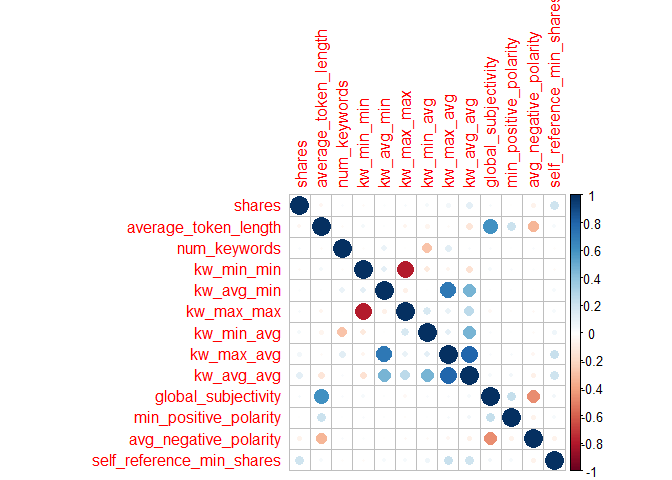
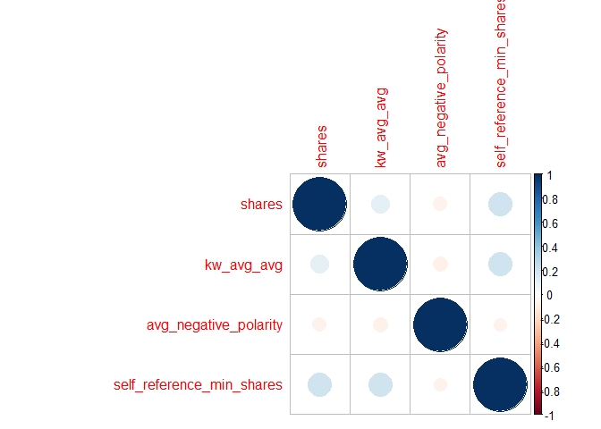

ST 558 Project 2
================
Jessica Speer
July 3, 2020

Load and Prep Data
==================

``` r
#Read in data, filter according to day of week, keep relevant variables
data<-read.csv("C:\\Users\\jessi\\Documents\\ST 558\\data\\OnlineNewsPopularity.csv", header=T)
data<-data %>% filter(weekday_is_monday==1) %>% select(-c(url, timedelta, weekday_is_monday, weekday_is_tuesday, weekday_is_wednesday, weekday_is_thursday, weekday_is_friday, weekday_is_saturday, weekday_is_sunday))
#Generate categorical outcome variable
data$sharescat[data$shares >= 1400] <- 0
data$sharescat[data$shares < 1400] <- 1
data$sharescat <- as.factor(data$sharescat)
#Split data into training and test sets
set.seed(1)
train <- sample(1:nrow(data), size = nrow(data)*0.7)
test <- dplyr::setdiff(1:nrow(data), train)
dataTrain <- data[train, ]
dataTest <- data[test, ]
```

``` r
step(lm(shares ~ n_tokens_title + n_tokens_content + n_unique_tokens + n_non_stop_words + n_non_stop_unique_tokens + num_hrefs + num_self_hrefs + num_imgs + num_videos + average_token_length + num_keywords + kw_min_min + kw_max_min + kw_avg_min + kw_min_max + kw_max_max + kw_avg_max + kw_min_avg + kw_max_avg + kw_avg_avg + LDA_00 + LDA_01 + LDA_02 +LDA_03 + LDA_04 + global_subjectivity + global_sentiment_polarity + title_subjectivity + title_sentiment_polarity + abs_title_subjectivity + abs_title_sentiment_polarity + global_rate_positive_words + global_rate_negative_words + rate_positive_words + rate_negative_words + avg_positive_polarity + min_positive_polarity + max_positive_polarity + avg_negative_polarity + min_negative_polarity + max_negative_polarity + self_reference_min_shares + self_reference_max_shares + self_reference_avg_sharess + data_channel_is_lifestyle + data_channel_is_entertainment + data_channel_is_bus + data_channel_is_socmed + data_channel_is_tech + data_channel_is_world, data=data))
```

``` r
lmod1<-train(shares ~ average_token_length + num_keywords + kw_min_min + 
    kw_avg_min + kw_max_max + kw_min_avg + kw_max_avg + kw_avg_avg + 
    global_subjectivity + min_positive_polarity + avg_negative_polarity + 
    self_reference_min_shares + data_channel_is_entertainment, data=data, method="lm")

summary(lmod1)
```

    ## 
    ## Call:
    ## lm(formula = .outcome ~ ., data = dat)
    ## 
    ## Residuals:
    ##    Min     1Q Median     3Q    Max 
    ## -90057  -2578  -1225    125 681671 
    ## 
    ## Coefficients:
    ##                                 Estimate Std. Error t value Pr(>|t|)    
    ## (Intercept)                    2.364e+02  1.697e+03   0.139 0.889229    
    ## average_token_length          -7.332e+02  2.811e+02  -2.608 0.009115 ** 
    ## num_keywords                   1.521e+02  1.006e+02   1.511 0.130819    
    ## kw_min_min                    -7.875e+00  4.088e+00  -1.926 0.054085 .  
    ## kw_avg_min                     1.048e+00  3.488e-01   3.004 0.002672 ** 
    ## kw_max_max                    -3.296e-03  1.346e-03  -2.449 0.014358 *  
    ## kw_min_avg                    -5.562e-01  2.152e-01  -2.584 0.009779 ** 
    ## kw_max_avg                    -4.217e-01  6.089e-02  -6.925 4.76e-12 ***
    ## kw_avg_avg                     2.618e+00  3.150e-01   8.311  < 2e-16 ***
    ## global_subjectivity            3.597e+03  2.070e+03   1.737 0.082346 .  
    ## min_positive_polarity         -4.823e+03  2.598e+03  -1.856 0.063454 .  
    ## avg_negative_polarity         -5.664e+03  1.598e+03  -3.544 0.000397 ***
    ## self_reference_min_shares      1.326e-01  1.159e-02  11.441  < 2e-16 ***
    ## data_channel_is_entertainment -1.065e+03  4.468e+02  -2.383 0.017183 *  
    ## ---
    ## Signif. codes:  0 '***' 0.001 '**' 0.01 '*' 0.05 '.' 0.1 ' ' 1
    ## 
    ## Residual standard error: 14390 on 6647 degrees of freedom
    ## Multiple R-squared:  0.04293,    Adjusted R-squared:  0.04106 
    ## F-statistic: 22.94 on 13 and 6647 DF,  p-value: < 2.2e-16

``` r
modcorr <- cor(select(dataTrain, shares, average_token_length, num_keywords, kw_min_min, kw_avg_min, kw_max_max, kw_min_avg, kw_max_avg, kw_avg_avg, global_subjectivity, min_positive_polarity, avg_negative_polarity, self_reference_min_shares))
corrplot(modcorr, method="circle")
```



``` r
lmod2<-train(shares ~ kw_avg_avg + avg_negative_polarity + self_reference_min_shares + data_channel_is_entertainment, data=data, method="lm")

summary(lmod2)
```

    ## 
    ## Call:
    ## lm(formula = .outcome ~ ., data = dat)
    ## 
    ## Residuals:
    ##    Min     1Q Median     3Q    Max 
    ## -99101  -2444  -1540   -352 684637 
    ## 
    ## Coefficients:
    ##                                 Estimate Std. Error t value Pr(>|t|)    
    ## (Intercept)                   -8.058e+02  5.502e+02  -1.465  0.14307    
    ## kw_avg_avg                     9.021e-01  1.304e-01   6.917 5.06e-12 ***
    ## avg_negative_polarity         -5.441e+03  1.428e+03  -3.811  0.00014 ***
    ## self_reference_min_shares      1.218e-01  1.146e-02  10.628  < 2e-16 ***
    ## data_channel_is_entertainment -1.021e+03  4.455e+02  -2.292  0.02193 *  
    ## ---
    ## Signif. codes:  0 '***' 0.001 '**' 0.01 '*' 0.05 '.' 0.1 ' ' 1
    ## 
    ## Residual standard error: 14460 on 6656 degrees of freedom
    ## Multiple R-squared:  0.03227,    Adjusted R-squared:  0.03169 
    ## F-statistic: 55.49 on 4 and 6656 DF,  p-value: < 2.2e-16

``` r
modcorr <- cor(select(dataTrain, shares, kw_avg_avg, avg_negative_polarity, self_reference_min_shares))
corrplot(modcorr, method="circle")
```



``` r
lmod2<-train(shares ~ kw_avg_avg + avg_negative_polarity + self_reference_min_shares + data_channel_is_entertainment, data=data, method="lm")

summary(lmod2)
```

    ## 
    ## Call:
    ## lm(formula = .outcome ~ ., data = dat)
    ## 
    ## Residuals:
    ##    Min     1Q Median     3Q    Max 
    ## -99101  -2444  -1540   -352 684637 
    ## 
    ## Coefficients:
    ##                                 Estimate Std. Error t value Pr(>|t|)    
    ## (Intercept)                   -8.058e+02  5.502e+02  -1.465  0.14307    
    ## kw_avg_avg                     9.021e-01  1.304e-01   6.917 5.06e-12 ***
    ## avg_negative_polarity         -5.441e+03  1.428e+03  -3.811  0.00014 ***
    ## self_reference_min_shares      1.218e-01  1.146e-02  10.628  < 2e-16 ***
    ## data_channel_is_entertainment -1.021e+03  4.455e+02  -2.292  0.02193 *  
    ## ---
    ## Signif. codes:  0 '***' 0.001 '**' 0.01 '*' 0.05 '.' 0.1 ' ' 1
    ## 
    ## Residual standard error: 14460 on 6656 degrees of freedom
    ## Multiple R-squared:  0.03227,    Adjusted R-squared:  0.03169 
    ## F-statistic: 55.49 on 4 and 6656 DF,  p-value: < 2.2e-16

Fit random forest
=================

``` r
set.seed(16)
#trctrl <- trainControl(method = "repeatedcv", number = 10, repeats = 3)
rf_fit <- train(sharescat ~ kw_avg_avg + avg_negative_polarity + self_reference_min_shares + data_channel_is_entertainment, data = dataTrain, method = "rf",
preProcess = c("center", "scale"))
rf_fit
```

    ## Random Forest 
    ## 
    ## 4662 samples
    ##    4 predictor
    ##    2 classes: '0', '1' 
    ## 
    ## Pre-processing: centered (4), scaled (4) 
    ## Resampling: Bootstrapped (25 reps) 
    ## Summary of sample sizes: 4662, 4662, 4662, 4662, 4662, 4662, ... 
    ## Resampling results across tuning parameters:
    ## 
    ##   mtry  Accuracy   Kappa    
    ##   2     0.5769236  0.1537998
    ##   3     0.5711485  0.1423033
    ##   4     0.5679434  0.1359489
    ## 
    ## Accuracy was used to select the optimal model using the largest value.
    ## The final value used for the model was mtry = 2.

``` r
#make predictions on test data
test_pred <- predict(rf_fit, newdata = dataTest)
res <- confusionMatrix(test_pred, dataTest$sharescat)
res
```

    ## Confusion Matrix and Statistics
    ## 
    ##           Reference
    ## Prediction   0   1
    ##          0 641 441
    ##          1 385 532
    ##                                           
    ##                Accuracy : 0.5868          
    ##                  95% CI : (0.5648, 0.6085)
    ##     No Information Rate : 0.5133          
    ##     P-Value [Acc > NIR] : 2.423e-11       
    ##                                           
    ##                   Kappa : 0.1718          
    ##                                           
    ##  Mcnemar's Test P-Value : 0.05566         
    ##                                           
    ##             Sensitivity : 0.6248          
    ##             Specificity : 0.5468          
    ##          Pos Pred Value : 0.5924          
    ##          Neg Pred Value : 0.5802          
    ##              Prevalence : 0.5133          
    ##          Detection Rate : 0.3207          
    ##    Detection Prevalence : 0.5413          
    ##       Balanced Accuracy : 0.5858          
    ##                                           
    ##        'Positive' Class : 0               
    ## 

``` r
#misclassification rate
1-sum(diag(res$table))/sum(res$table)
```

    ## [1] 0.4132066
